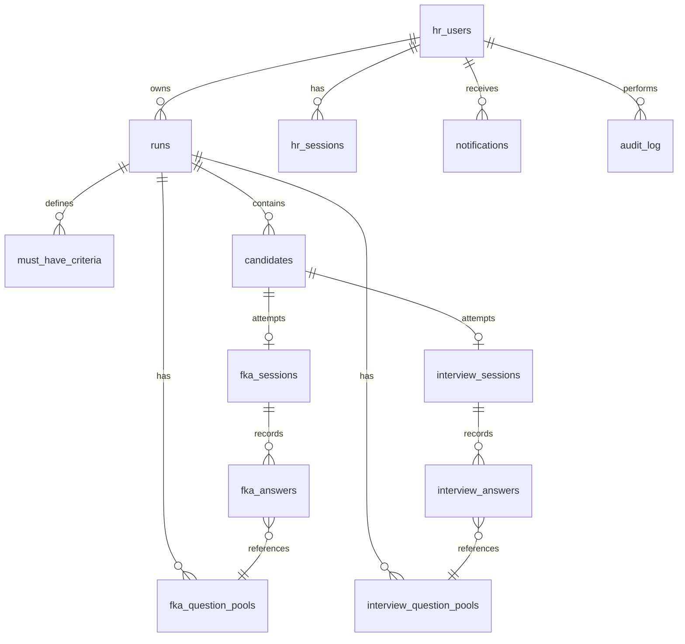

# IntiqAI — Database Design Document

> **Purpose:** This document outlines the full relational database schema that would replace the current flat-file JSON store (`db/intiqai_store.json`) to make the IntiqAI platform production-ready, scalable, and secure.
>
> **Recommended Engine:** PostgreSQL (with a migration path from the current JSON store).

---

## Table of Contents

1. [Overview & Entity Map](#1-overview--entity-map)
2. [Schema: Users & Authentication](#2-schema-users--authentication)
3. [Schema: CV Runs & Results](#3-schema-cv-runs--results)
4. [Schema: Candidates](#4-schema-candidates)
5. [Schema: FKA (Functional Knowledge Assessment)](#5-schema-fka-functional-knowledge-assessment)
6. [Schema: Interviews](#6-schema-interviews)
7. [Schema: Notifications & Audit Log](#7-schema-notifications--audit-log)
8. [Relationships Diagram](#8-relationships-diagram)
9. [Key Design Decisions](#9-key-design-decisions)
10. [Migration Strategy](#10-migration-strategy)

---

## 1. Overview & Entity Map

The platform manages the full lifecycle of a hiring process. The core entities are:

| Entity | Description |
|---|---|
| **HR Users** | The company's HR team members who use the platform |
| **Admin** | Super-admin with approval/oversight privileges |
| **Runs** | A single CV-screening job (one JD + a batch of CVs) |
| **Candidates** | Applicants found within a run |
| **FKA Sessions** | A candidate's Functional Knowledge Assessment attempt |
| **FKA Questions** | The pool of questions generated per run |
| **Interview Sessions** | A candidate's AI voice/text interview |
| **Interview Questions** | The pool of interview questions generated per run |
| **Notifications** | Admin alerts (e.g. new signup, approval events) |
| **Audit Log** | Immutable record of all sensitive actions |

---

## 2. Schema: Users & Authentication

### `hr_users`

The central table for all HR-level accounts, including the super-admin.

| Column | Type | Constraints | Notes |
|---|---|---|---|
| `id` | `UUID` | `PRIMARY KEY`, `DEFAULT gen_random_uuid()` | Stable user identifier |
| `email` | `VARCHAR(255)` | `UNIQUE`, `NOT NULL` | Login email (lowercased) |
| `password_hash` | `TEXT` | `NOT NULL` | Bcrypt hash — **never plain text** |
| `role` | `ENUM('hr', 'admin')` | `NOT NULL`, `DEFAULT 'hr'` | Role-based access control |
| `approved` | `BOOLEAN` | `NOT NULL`, `DEFAULT FALSE` | Admin must approve before login |
| `approved_by` | `UUID` | `REFERENCES hr_users(id)` | FK to the admin who approved |
| `approved_at` | `TIMESTAMPTZ` | | When approved |
| `created_at` | `TIMESTAMPTZ` | `DEFAULT NOW()` | Signup timestamp |
| `last_login_at` | `TIMESTAMPTZ` | | Updated on every successful login |
| `is_active` | `BOOLEAN` | `DEFAULT TRUE` | Soft-delete / account suspend |

> **Notes:**
> - The `admin` role should be seeded at deployment, not registered publicly.
> - `password_hash` must use a modern, salted algorithm (e.g. Bcrypt with cost factor ≥ 12, or Argon2id).
> - A unique partial index on `email WHERE is_active = TRUE` prevents duplicate active accounts.

### `hr_sessions`

Stores active login sessions (replaces cookie-based `hr_token = "ok"`).

| Column | Type | Constraints | Notes |
|---|---|---|---|
| `id` | `UUID` | `PRIMARY KEY` | Session token (stored in cookie) |
| `user_id` | `UUID` | `NOT NULL`, `REFERENCES hr_users(id) ON DELETE CASCADE` | Who this session belongs to |
| `created_at` | `TIMESTAMPTZ` | `DEFAULT NOW()` | |
| `expires_at` | `TIMESTAMPTZ` | `NOT NULL` | Rolling 7-day expiry |
| `ip_address` | `INET` | | Optional: for security monitoring |
| `user_agent` | `TEXT` | | Optional: for security monitoring |

---

## 3. Schema: CV Runs & Results

### `runs`

A single execution of the CV screening pipeline for one job position.

| Column | Type | Constraints | Notes |
|---|---|---|---|
| `id` | `UUID` | `PRIMARY KEY` | Stable run identifier |
| `owner_id` | `UUID` | `NOT NULL`, `REFERENCES hr_users(id)` | The HR user who created this run |
| `jd_title` | `VARCHAR(500)` | | Extracted job title from JD |
| `jd_text` | `TEXT` | | Full improved JD text (post-LLM) |
| `status` | `ENUM('pending_review', 'confirmed', 'archived')` | `NOT NULL`, `DEFAULT 'pending_review'` | HR workflow state |
| `total_resumes` | `INTEGER` | | Count of all uploaded CVs |
| `shortlisted_count` | `INTEGER` | | Count of CVs above threshold |
| `all_results_file` | `TEXT` | | Path or object-storage key for the full results Excel |
| `high_scoring_file` | `TEXT` | | Path or object-storage key for high-scoring Excel |
| `improved_jd_file` | `TEXT` | | Path or object-storage key for the improved JD PDF |
| `created_at` | `TIMESTAMPTZ` | `DEFAULT NOW()` | |
| `confirmed_at` | `TIMESTAMPTZ` | | When HR clicked "Confirm & Send" |

### `must_have_criteria`

Stores the parsed must-have requirements for a run (extracted from the JD by the LLM).

| Column | Type | Constraints | Notes |
|---|---|---|---|
| `id` | `UUID` | `PRIMARY KEY` | |
| `run_id` | `UUID` | `NOT NULL`, `REFERENCES runs(id) ON DELETE CASCADE` | |
| `criterion` | `TEXT` | `NOT NULL` | E.g. "5+ years Python experience" |
| `type` | `ENUM('must_have', 'nice_to_have')` | `NOT NULL` | |

---

## 4. Schema: Candidates

### `candidates`

One row per CV/applicant within a run.

| Column | Type | Constraints | Notes |
|---|---|---|---|
| `id` | `UUID` | `PRIMARY KEY` | |
| `run_id` | `UUID` | `NOT NULL`, `REFERENCES runs(id) ON DELETE CASCADE` | Parent run |
| `first_name` | `VARCHAR(255)` | | Extracted from CV |
| `last_name` | `VARCHAR(255)` | | Extracted from CV |
| `email` | `VARCHAR(255)` | | Contact email (used for credential delivery) |
| `password_hash` | `TEXT` | | Hashed candidate login password |
| `password_reset_token` | `TEXT` | | Single-use token for set-password flow |
| `password_reset_expires_at` | `TIMESTAMPTZ` | | Token expiry |
| `resume_link` | `TEXT` | | Filename / object-storage key for the CV PDF |
| `overall_fit_score` | `NUMERIC(4,1)` | | LLM-assigned score (0–10) |
| `justification` | `TEXT` | | LLM reasoning for the score |
| `status` | `ENUM('shortlisted', 'disqualified', 'withdrawn')` | `NOT NULL` | CV screening outcome |
| `pipeline_stage` | `ENUM('cv_screened', 'fka_pending', 'fka_passed', 'fka_failed', 'interview_pending', 'interview_done', 'hired', 'rejected')` | `NOT NULL`, `DEFAULT 'cv_screened'` | Current stage in the hiring pipeline |
| `credentials_sent_at` | `TIMESTAMPTZ` | | When login credentials were emailed |
| `created_at` | `TIMESTAMPTZ` | `DEFAULT NOW()` | |

> **Notes:**
> - `email` should have a `UNIQUE` constraint scoped to the `run_id` to allow the same person to apply to multiple positions.
> - `resume_link` should point to an object storage path (e.g. S3/GCS) in production, not a local filesystem path.

---

## 5. Schema: FKA (Functional Knowledge Assessment)

### `fka_question_pools`

The pool of questions generated by the LLM for a specific run's FKA.

| Column | Type | Constraints | Notes |
|---|---|---|---|
| `id` | `UUID` | `PRIMARY KEY` | |
| `run_id` | `UUID` | `NOT NULL`, `REFERENCES runs(id) ON DELETE CASCADE` | |
| `category` | `VARCHAR(255)` | `NOT NULL` | E.g. "Concept", "Coding", "Scenario" |
| `question_text` | `TEXT` | `NOT NULL` | The question itself |
| `expected_keywords` | `TEXT[]` | | Array of acceptable answer keywords |
| `must_ask` | `BOOLEAN` | `DEFAULT FALSE` | Flagged as priority question |
| `created_at` | `TIMESTAMPTZ` | `DEFAULT NOW()` | |

### `fka_sessions`

One row per candidate's FKA attempt.

| Column | Type | Constraints | Notes |
|---|---|---|---|
| `id` | `UUID` | `PRIMARY KEY` | |
| `candidate_id` | `UUID` | `NOT NULL`, `REFERENCES candidates(id) ON DELETE CASCADE` | |
| `run_id` | `UUID` | `NOT NULL`, `REFERENCES runs(id)` | Denormalized for easy filtering |
| `status` | `ENUM('in_progress', 'passed', 'failed', 'timed_out')` | `NOT NULL`, `DEFAULT 'in_progress'` | |
| `score` | `INTEGER` | | Final score out of 100 |
| `pass_threshold` | `INTEGER` | `DEFAULT 70` | Passing mark for this run |
| `started_at` | `TIMESTAMPTZ` | `DEFAULT NOW()` | |
| `completed_at` | `TIMESTAMPTZ` | | |
| `strengths` | `TEXT[]` | | LLM-identified strengths |
| `weaknesses` | `TEXT[]` | | LLM-identified areas for improvement |
| `overall_justification` | `TEXT` | | LLM narrative summary |

### `fka_answers`

Individual question responses within an FKA session.

| Column | Type | Constraints | Notes |
|---|---|---|---|
| `id` | `UUID` | `PRIMARY KEY` | |
| `session_id` | `UUID` | `NOT NULL`, `REFERENCES fka_sessions(id) ON DELETE CASCADE` | |
| `question_id` | `UUID` | `NOT NULL`, `REFERENCES fka_question_pools(id)` | |
| `answer_text` | `TEXT` | | Candidate's response |
| `is_correct` | `BOOLEAN` | | LLM-evaluated correctness |
| `score_contribution` | `INTEGER` | | Points awarded for this answer |
| `answered_at` | `TIMESTAMPTZ` | `DEFAULT NOW()` | |

---

## 6. Schema: Interviews

### `interview_question_pools`

Pool of AI-generated interview questions per run.

| Column | Type | Constraints | Notes |
|---|---|---|---|
| `id` | `UUID` | `PRIMARY KEY` | |
| `run_id` | `UUID` | `NOT NULL`, `REFERENCES runs(id) ON DELETE CASCADE` | |
| `category` | `VARCHAR(255)` | | E.g. "Behavioral", "Technical", "Situational" |
| `question_text` | `TEXT` | `NOT NULL` | |
| `expected_keywords` | `TEXT[]` | | Evaluation guidance for the LLM |
| `must_ask` | `BOOLEAN` | `DEFAULT FALSE` | |
| `created_at` | `TIMESTAMPTZ` | `DEFAULT NOW()` | |

### `interview_sessions`

One row per candidate's interview attempt.

| Column | Type | Constraints | Notes |
|---|---|---|---|
| `id` | `UUID` | `PRIMARY KEY` | |
| `candidate_id` | `UUID` | `NOT NULL`, `REFERENCES candidates(id) ON DELETE CASCADE` | |
| `run_id` | `UUID` | `NOT NULL`, `REFERENCES runs(id)` | Denormalized for easy filtering |
| `type` | `ENUM('voice', 'text')` | `NOT NULL`, `DEFAULT 'voice'` | Interview modality |
| `status` | `ENUM('pending', 'in_progress', 'completed', 'abandoned')` | `NOT NULL`, `DEFAULT 'pending'` | |
| `overall_feedback` | `TEXT` | | HR-visible LLM evaluation summary |
| `communication_score` | `NUMERIC(4,1)` | | LLM-rated communication score |
| `technical_score` | `NUMERIC(4,1)` | | LLM-rated technical knowledge score |
| `started_at` | `TIMESTAMPTZ` | | |
| `completed_at` | `TIMESTAMPTZ` | | |

### `interview_answers`

Individual question/answer pairs within an interview session.

| Column | Type | Constraints | Notes |
|---|---|---|---|
| `id` | `UUID` | `PRIMARY KEY` | |
| `session_id` | `UUID` | `NOT NULL`, `REFERENCES interview_sessions(id) ON DELETE CASCADE` | |
| `question_id` | `UUID` | `NOT NULL`, `REFERENCES interview_question_pools(id)` | |
| `question_number` | `INTEGER` | | Order in the interview |
| `answer_text` | `TEXT` | | Transcribed or typed answer |
| `audio_file_key` | `TEXT` | | Object-storage key for voice recording (if voice interview) |
| `llm_score` | `NUMERIC(4,1)` | | Per-answer LLM evaluation |
| `llm_feedback` | `TEXT` | | Per-answer explanation |
| `answered_at` | `TIMESTAMPTZ` | `DEFAULT NOW()` | |

---

## 7. Schema: Notifications & Audit Log

### `notifications`

System-generated events for the admin inbox.

| Column | Type | Constraints | Notes |
|---|---|---|---|
| `id` | `UUID` | `PRIMARY KEY` | |
| `recipient_id` | `UUID` | `REFERENCES hr_users(id) ON DELETE CASCADE` | Who receives this notification |
| `type` | `ENUM('new_signup', 'user_approved', 'user_rejected', 'run_complete', 'candidate_hired')` | `NOT NULL` | Event classification |
| `title` | `VARCHAR(500)` | `NOT NULL` | Short title |
| `body` | `TEXT` | | Full notification body |
| `is_read` | `BOOLEAN` | `DEFAULT FALSE` | |
| `related_entity_id` | `UUID` | | ID of the related run, user, or candidate |
| `created_at` | `TIMESTAMPTZ` | `DEFAULT NOW()` | |

### `audit_log`

Immutable log of all sensitive actions in the system. **No records are ever deleted from this table.**

| Column | Type | Constraints | Notes |
|---|---|---|---|
| `id` | `UUID` | `PRIMARY KEY` | |
| `actor_id` | `UUID` | `REFERENCES hr_users(id) ON DELETE SET NULL` | Who performed the action |
| `actor_email` | `VARCHAR(255)` | `NOT NULL` | Denormalized in case user is later deleted |
| `action` | `VARCHAR(255)` | `NOT NULL` | E.g. `"USER_APPROVED"`, `"RUN_CONFIRMED"`, `"CANDIDATE_DELETED"` |
| `target_type` | `VARCHAR(100)` | | E.g. `"hr_user"`, `"run"`, `"candidate"` |
| `target_id` | `UUID` | | ID of the affected entity |
| `metadata` | `JSONB` | | Arbitrary extra context (e.g. old/new values) |
| `ip_address` | `INET` | | |
| `created_at` | `TIMESTAMPTZ` | `DEFAULT NOW()` | |

---

## 8. Relationships Diagram

---

## 9. Key Design Decisions

### 9.1 Password Security
All passwords (HR users and candidates) must be stored using a strong hashing algorithm. **Plain-text storage is not acceptable for production.** Recommended: **Argon2id** or **Bcrypt** (cost ≥ 12).

### 9.2 Session Management
Replace the current cookie value of `"ok"` with a cryptographically random UUID stored in `hr_sessions`. The cookie holds only the session ID; all trust decisions are made server-side by looking up the session table.

### 9.3 Multi-Tenancy
The `owner_id` on `runs` is the foundation for data isolation. All queries against `runs`, `candidates`, `fka_sessions`, etc., should include a `WHERE runs.owner_id = $current_user_id` filter for non-admin users. Admins bypass this filter.

### 9.4 Soft Deletes
Sensitive records (users, candidates) should be marked `is_active = FALSE` rather than hard-deleted. This preserves referential integrity and maintains a history. The `audit_log` captures who performed the deletion and when.

### 9.5 File Storage
File paths (`resume_link`, `all_results_file`, etc.) must reference an **object storage service** (AWS S3, GCS, or Azure Blob) in production — not a local filesystem. The database stores the **object key**, and a signed URL is generated per request.

### 9.6 Enum Extensibility
Pipeline stages and statuses are defined as enums but should be designed with future stages in mind (e.g. `"offer_extended"`, `"background_check"`). Consider using a `VARCHAR` with a `CHECK` constraint instead of a true `ENUM` type if you anticipate frequent additions.

### 9.7 Indexing Strategy
Critical indexes to add beyond primary keys:

| Table | Index On | Reason |
|---|---|---|
| `hr_users` | `email` | Fast login lookup |
| `hr_sessions` | `expires_at` | Efficient session cleanup job |
| `candidates` | `run_id`, `status` | Dashboard filtering |
| `candidates` | `email` | Candidate login lookup |
| `fka_sessions` | `candidate_id` | Per-candidate lookup |
| `interview_sessions` | `candidate_id` | Per-candidate lookup |
| `audit_log` | `actor_id`, `created_at` | Admin reporting queries |

---

## 10. Migration Strategy

### Phase 1 — Schema Setup
- Deploy the database schema to a PostgreSQL instance.
- Seed the admin user with a secure password hash.

### Phase 2 — Data Migration from JSON
The current `db/intiqai_store.json` contains three root arrays: `runs`, `candidates` (nested), and `hr_users`. The migration script should:
1. Read `hr_users` → insert into `hr_users`, generating UUID if not present.
2. Read `runs` → insert into `runs`, linking to the HR user or falling back to the first admin.
3. For each run, read nested `candidates` → insert into `candidates`.
4. For each run, read nested `fka_questions_pool` / `interview_questions_pool` → insert into the respective pool tables.
5. For each candidate, read `fka_score`, `fka_session_id`, `interview_feedback` → insert into `fka_sessions` / `interview_sessions`.

### Phase 3 — Application Layer Update
Replace direct calls to `db/store.py` JSON functions with SQL queries or an ORM (e.g. SQLAlchemy with async support via `asyncpg`). Keep the existing function signatures in `store.py` as the interface — only the internals change.

### Phase 4 — Verification & Cutover
- Run both stores in parallel (write to both, read from DB) during a transition period.
- Validate record counts and spot-check data integrity.
- Switch reads to DB-only, then remove JSON-file writes.
